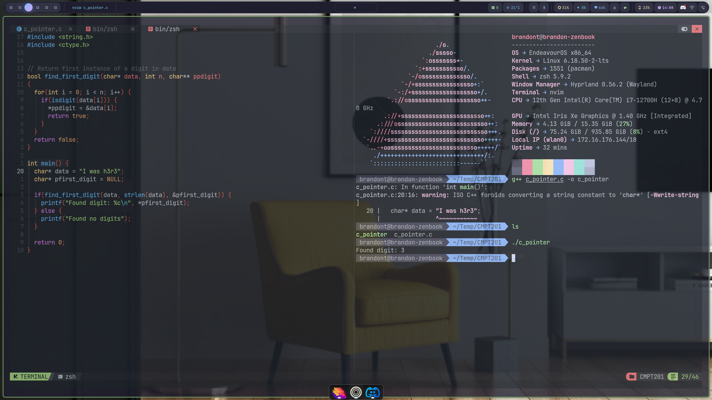
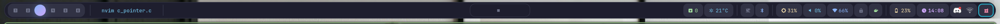
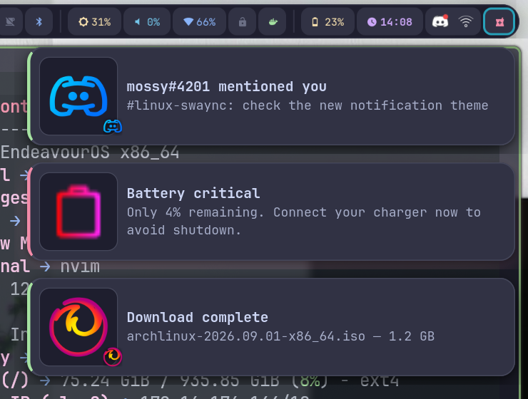
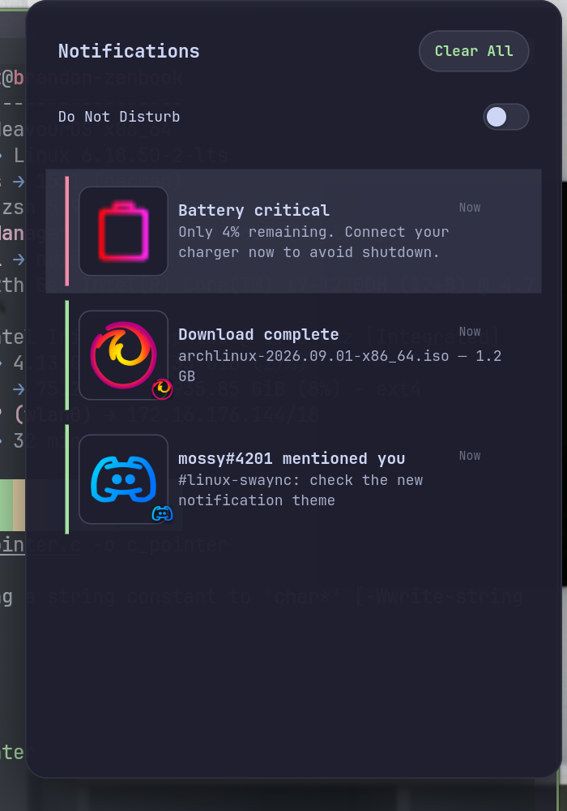

# my-dotfiles

Personal dotfiles for **Arch Linux** with **Hyprland**, currently themed **Catppuccin Mocha**.

## Screenshots

| Desktop | Waybar |
|---------|--------|
|  |  |

| Notification popups | Notification center |
|---------------------|---------------------|
|  |  |

## Features

- **Window manager** — Hyprland with a Lua-based config (`hyprland.lua`, `keybinds.lua`, `autostart.lua`, …)
- **Waybar** — workspaces, window title, Spotify, package updates, weather, FortiClient VPN status, Docker status, idle inhibitor, Bluetooth, backlight, audio, network, battery, clock, system tray
- **Notification center** — [SwayNC](https://github.com/ErikReider/SwayNotificationCenter) with a Catppuccin theme:
  - Notification bell in waybar: red when unread, amber when Do Not Disturb is on
  - Left-click the bell → notification center panel · right-click → DND · middle-click → clear all
  - Urgency accents (red = critical, green = normal, gray = low) on popups and panel rows
  - Critical notifications stay on screen until dismissed
- **Theme system** — one command restyles everything (waybar, swaync, Hyprland, kitty, rofi, GTK, Neovim, AGS, spicetify, wallpaper) from a single palette file:
  - `SUPER + SHIFT + T` — Rofi picker with palette previews
  - `~/.config/theme/apply.sh catppuccin` — or `matcha`, `monochrome`, `tokyo-night`
  - Configs are generated from `templates/` — edit templates, not the live files, or changes are lost on the next switch
- **Terminal** — kitty · **Editor** — Neovim (NvChad) · **Launcher** — Rofi · **Wallpaper** — swww · **Audio** — PipeWire + EasyEffects · **File manager** — Thunar

## Install

### 1. Packages

```bash
yay -S --needed \
    hyprland hyprlock hypridle xdg-desktop-portal-hyprland \
    waybar swaync \
    kitty neovim rofi-wayland \
    dunst libnotify \
    pipewire pipewire-alsa pipewire-pulse pipewire-jack wireplumber \
    pavucontrol easyeffects \
    thunar thunar-archive-plugin thunar-volman gvfs \
    imv swww \
    gtk3 gtk4 fontconfig \
    aylurs-gtk-shell \
    nodejs npm typescript \
    ttf-jetbrains-mono-nerd ttf-font-awesome otf-font-awesome \
    polkit-gnome \
    grim slurp wl-clipboard \
    brightnessctl \
    network-manager-applet \
    bluez bluez-utils blueman \
    papirus-icon-theme papirus-folders \
    playerctl imagemagick \
    unzip zip p7zip \
    xdg-user-dirs \
    qt5-wayland qt6-wayland
```

> `dunst` is only installed for `dunstify` (used by the Spotify track-change script); **swaync** is the actual notification daemon.

### 2. Install the dotfiles

```bash
git clone https://github.com/BrandonKenjii/my-dotfiles.git ~/my-dotfiles
cd ~/my-dotfiles
./install.sh              # symlinks configs into ~/.config/
~/.config/theme/apply.sh catppuccin   # generates themed configs (incl. swaync)
```

Then log out and back in (Hyprland autostarts swaync and waybar).

### Post-install

```bash
systemctl --user enable --now pipewire pipewire-pulse wireplumber
cd ~/.config/ags && npm install   # AGS shell, if used
```

## Theme switching

```bash
~/.config/theme/apply.sh catppuccin      # catppuccin | matcha | monochrome | tokyo-night
```

or press `SUPER + SHIFT + T` for the Rofi picker. The theme script regenerates every themed config, reloads services, and swaps the wallpaper.

## Directory structure

```
.config/
├── ags/           # AGS shell widgets
├── hypr/          # Hyprland config (Lua)
├── kitty/         # Terminal
├── nvim/          # Neovim (NvChad)
├── rofi/          # Launcher
├── swaync/        # Notification center (generated by theme system)
├── theme/         # Theme system: templates/, themes/, apply.sh, switch.sh
├── waybar/        # Status bar
├── gtk-3.0, gtk-4.0/   # GTK theme
├── pipewire/      # Audio
├── dunst/         # dunstify helper scripts
└── ...
```

## Troubleshooting

| Problem | Fix |
|---|---|
| Waybar not showing | `killall waybar && waybar &` |
| Bell missing from waybar | Re-apply a theme: `~/.config/theme/apply.sh catppuccin` |
| Notifications not appearing | Make sure swaync is running: `systemctl --user status swaync` |
| Audio issues | `systemctl --user restart pipewire pipewire-pulse wireplumber` |
| Hyprland crashes | `cat ~/.local/share/hyprland/hyprland.log` |
